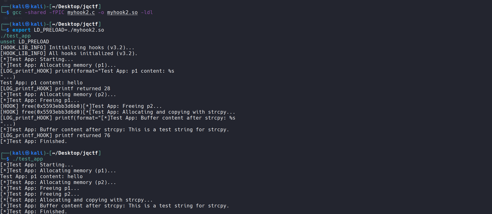

# LD_PRELOAD-Hook111

Develop a dynamic library that is injected into a target process via the LD_PRELOAD environment variable to intercept specific libc functions (such as malloc, free, strcpy, system, etc.). This can be used for:

- **Behavior Monitoring:** Logging function call arguments and return values to analyze program behavior.
- **Basic Security Auditing:** Detecting the use of dangerous functions (e.g., strcpy) or performing preliminary input validation.
- **Simplified Memory Leak Detection:** Tracking malloc/free pairing.

#### How to use?

```
export LD_PRELOAD=./myhook.so                
./your_program_name
unset LD_PRELOAD
```

#### Its effect

```
┌──(kali㉿kali)-[~/Desktop/jqctf]
└─$ export LD_PRELOAD=./myhook.so                
./test_app
unset LD_PRELOAD
[HOOK_LIB_INFO] Initializing hooks (v3.2)...
[HOOK_SNPRINTF_FALLBACK_S] originals NULL or in init.
[HOOK_SNPRINTF_FALLBACK_S] originals NULL or in init.
[HOOK_SNPRINTF_FALLBACK_S] originals NULL or in init.
[HOOK_SNPRINTF_FALLBACK_S] originals NULL or in init.
[HOOK_SNPRINTF_FALLBACK_S] originals NULL or in init.
[HOOK_SNPRINTF_FALLBACK_S] originals NULL or in init.
[HOOK_SNPRINTF_FALLBACK_S] originals NULL or in init.
[HOOK_SNPRINTF_FALLBACK_S] originals NULL or in init.
[HOOK_SNPRINTF_FALLBACK_S] originals NULL or in init.
[HOOK_SNPRINTF_FALLBACK_S] originals NULL or in init.
[HOOK_SNPRINTF_FALLBACK_S] originals NULL or in init.
[HOOK_SNPRINTF_FALLBACK_S] originals NULL or in init.
[HOOK_SNPRINTF_FALLBACK_S] originals NULL or in init.
[HOOK_SNPRINTF_FALLBACK_S] originals NULL or in init.
[HOOK_SNPRINTF_FALLBACK_S] originals NULL or in init.
[HOOK_SNPRINTF_FALLBACK_S] originals NULL or in init.
[HOOK_SNPRINTF_FALLBACK_S] originals NULL or in init.
[HOOK_SNPRINTF_FALLBACK_S] originals NULL or in init.
[HOOK_SNPRINTF_FALLBACK_S] originals NULL or in init.
[HOOK_SNPRINTF_FALLBACK_S] originals NULL or in init.
[HOOK_SNPRINTF_FALLBACK_S] originals NULL or in init.
[HOOK_SNPRINTF_FALLBACK_S] originals NULL or in init.
[HOOK_LIB_INFO] All hooks initialized (v3.2).
[*]Test App: Starting...
[*]Test App: Allocating memory (p1)...
[LOG_printf_HOOK] printf(format="Test App: p1 content: %s
"...)
Test App: p1 content: hello
[LOG_printf_HOOK] printf returned 28
[*]Test App: Allocating memory (p2)...
[*]Test App: Freeing p1...
[HOOK] free(0x55e2d55516b0)[*]Test App: Freeing p2...
[HOOK] free(0x55e2d55516d0)[*[Test App: Allocating and copying with strcpy...
[LOG_printf_HOOK] printf(format="[*]Test App: Buffer content after strcpy: %s
"...)
[*]Test App: Buffer content after strcpy: This is a test string for strcpy.
[LOG_printf_HOOK] printf returned 76
[*]Test App: Finished.
                                                                                                                                                                        
┌──(kali㉿kali)-[~/Desktop/jqctf]
└─$ ./test_app
[*]Test App: Starting...
[*]Test App: Allocating memory (p1)...
Test App: p1 content: hello
[*]Test App: Allocating memory (p2)...
[*]Test App: Freeing p1...
[*]Test App: Freeing p2...
[*[Test App: Allocating and copying with strcpy...
[*]Test App: Buffer content after strcpy: This is a test string for strcpy.
[*]Test App: Finished.
```

